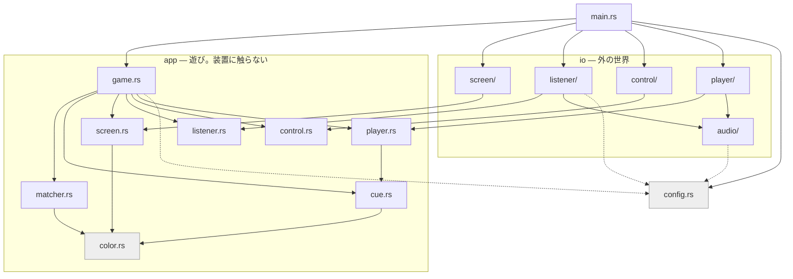

# donna-iro

「どんな色がすき？」と呼びかけ、子どもが叫んだ色名を聞き取って、その色の続きが流れる遊び。
テレビに色を映しながら鳴らす。対象は2歳児。

```
intro
  ↓
┌→ question            どんないろがすき？（ト長調）
│    ↓ 最大5秒待つ（何も言わなければランダムな色）
│  <color>              その色の節（5小節・ト長調）
│    ↓
│  tail / tail-lead     節の最終小節。間奏へ向かうときだけ助走つき
│    ↓
│  bridge / interlude   3周に1回、交互に挟む
└──┘                    「ぜんぶ！」と言うまで無限ループ
     ↓「ぜんぶ！」
   finale               転調 → ぜんぶの節 → エンディング（色がシャッフル）
     ↓
   もう1回？             操作を待つ。押されたら intro へ戻り、
                         何もされなければ終わり
```

## 準備

```sh
git clone --recursive git@github.com:mpyw/donna-iro.git
cd donna-iro
mise install                # cmake と git-lfs（mise.toml）
git -C assets lfs pull      # 音源を取る
tools/fetch-model.sh        # whisper のモデルを取る（base・141MB）
cargo build --release
```

```sh
./target/release/donna-iro
```

`cargo` が暗黙に叩く道具のうち、**`mise.toml` に載るのは cmake と git-lfs
だけ。** whisper.cpp のビルドには libclang（`bindgen` が使う）も要り、
ラズパイでは ALSA の開発ヘッダも要るが、どちらも OS の側から来るので mise
では宣言できない。**足りないものは `tools/check.sh` が冒頭で名前を出して
止める。** `mise.toml` を依存の全部だと思って読まないこと。

つくよみちゃんの音源が `assets/` に揃うまでは、確認用の合成音
（`assets/reference/`）に自動で落ちる。音源を置いた時点で、何もしなくても
そちらに切り替わる。

### 実行時の切り替え

| | |
| --- | --- |
| `--terminal` | ウィンドウを使わず色名だけ出す |
| `--keyboard` | マイクの代わりに手打ち |
| `--once` | フィナーレで終わる。「もう1回」を待たない |
| `--config <path>` | 別の設定ファイルを読む（既定はカレントの `config.toml`） |
| `--help` | 使い方 |

知らない引数と、値の無い `--config` はエラーで止まる。`--config` に指定した
ファイルが無いときも同じ。**指定したのに効いていない、が一番たちが悪い。**

つまみは全部 `config.toml` にある。**同じ項目は環境変数でも上書きでき、名前は
キーの位置から機械的に決まる。** 接頭辞は `DONNA_IRO_`、節とキーの区切りは
`__`（2本）。キー名自体に `_` が入るので、節の区切りは別の記号にしてある。

```sh
DONNA_IRO_RECOGNIZE__AUDIO_CTX=512 cargo run           # recognize.audio_ctx
DONNA_IRO_LISTEN__THRESHOLD=0.02 cargo run             # listen.threshold
DONNA_IRO_PATHS__MODEL=models/ggml-tiny.bin cargo run  # paths.model
```

何をいじれるかは `config.toml` を見ること。全項目にコメントと、対応する
環境変数名が書いてある。

### macOS の .app

```sh
tools/bundle-mac.sh     # target/donna-iro.app
```

Metal を有効にするので認識が CPU より速い。音源とモデルは埋め込む
（`.app` は CWD が `/` になるため、相対パスでは読めない）。

**本番音源が無ければ確認用の合成音で組む。** 実行時は `assets/` が欠けて
いれば `assets/reference/` に落ちるが、`include_bytes!` はファイルの有無を
見られないので、埋め込みでは同じ手が使えない。スクリプトが見て
`embed-reference` に切り替える。`assets/` へコピーする手もあるが、
あそこは private サブモジュールなので汚したくない。

`Info.plist` にマイクの用途を書いてあるので、初回に許可を聞かれる。

### ラズパイに配る

```sh
tools/build-pi.sh          # 組むだけ → target/pi/donna-iro
tools/build-pi.sh pi5      # 組んで ssh 先の ~/donna-iro へ配る
```

**sysroot を使うクロスコンパイルはしない。** macOS から
`aarch64-unknown-linux-gnu` を直接狙うと、whisper.cpp（cmake + bindgen）と
ALSA のために sysroot・クロス gcc/g++・libclang のターゲット指定が要る。
代わりに **arm64 の Debian コンテナの中でネイティブに組む。** Apple Silicon
なら linux/arm64 はエミュレーションなしで動くので、whisper.cpp 込みで1分を
切る。イメージは Pi と同じ trixie に固定してある（**新しくすると glibc が
前方互換でないので Pi 側で `GLIBC_2.xx not found` になる**）。Intel Mac では
エミュレーションになって現実的な速さにならないので、そのときは Pi 側で
`cargo build` するほうが早い。

**Pi 側に rust も cmake も入れない。** 実行時に要るのは `libasound.so.2` と
`libstdc++.so.6`、それに window を使うなら X11 と xkbcommon で、どれも
Raspberry Pi OS のデスクトップ版に既に入っている。足りなければスクリプトが
名前を出す。

**埋め込み（`embed`）は使わない。** Pi ではバイナリの隣にファイルを置けるので、
141MB のモデルを焼き込む理由が無い。差し替えも rsync だけで済む。埋め込みが
要るのは CWD が `/` になる macOS の `.app` のほう。

**音源とモデルは手元から送る。** `assets/` は private サブモジュールなので、
Pi に鍵を置いて `known_hosts` を通すまで Pi 側では clone できない。
`models/*.bin` は全部送るので、`tiny` に落として速さを比べるのもそのままできる。

**OS 側の設定も一緒に配る**（`pi/`）。音量つまみと全画面のルールは
バイナリに入れられないので外に出るしかない。**手で置くと Git の外に出て次に
再現できない**ので repo で持つ。中身が違うものが既にあれば `*.bak` に退避
してから置き、退避したことは必ず言う。詳しくは `pi/README.md`。

### ビルドの切り替え

| フィーチャー | |
| --- | --- |
| `whisper` | 音声認識。外すとキーボード入力のみ（ビルドが数十秒で済む） |
| `window` | ウィンドウ描画。外すとターミナルに色名だけ。文字描画（`fontdue`）も付いてくる |
| `embed-audio` | 音源をバイナリに埋め込む（`assets/*.wav` が揃っている必要がある） |
| `embed-reference` | 本番音源の代わりに確認用の合成音を埋め込む。**実行時のフォールバックは埋め込みに効かない**ので、`.app` を試しに作るときはこちら |
| `embed-model` | whisper のモデル（base・141MB）も埋め込む |
| `embed` | `embed-audio` と `embed-model`。**バイナリ1つで完結**する。合成音で組んだ `.app` で 157MB（モデルが 141MB） |
| `coreml` | Apple 専用。Metal は macOS で**既定有効**なので指定不要 |
| `openblas` / `openmp` | ラズパイ側の加速。素でも NEON は使うので、まず無指定で測る |

## 設計方針

### 無反応にしない

これが最優先。2歳児は間違った色が流れても大して気にしないが、
声を出したのに何も起きないと一気に興味を失う。

**失敗モードを「無反応」ではなく「違う色」に倒す。** 聞き取れなければ
ランダムな色を鳴らす。フォールバックが「ぜんぶ」に倒れないよう型で塞いである
（事故でゲームが終わってしまうため）。

### フィナーレのあとだけポリシーが反転する

「もう1回」を待つところは、逆に**無反応を「終わり」と読む**。遊びのループの
外なので、黙っていることは続ける意思が無いことと同じ。ここでランダムに
倒すと永久に終われない。

待ちは**声では受けない**（`control.rs`）。歓声や物音で勝手に再開してしまうし、
続けるかを決めるのは親の仕事だから。マウス・キーボード・テレビのリモコンは
供給元が違うだけなので口は1つにまとめてあり、CEC のリモコンを足すときも
送り手を1本増やすだけで済む。

**送り手が落ちること（ウィンドウが閉じられた）が、そのまま終了の合図になる。**
終わるための経路を別に用意しなくてよい。

待っている間は、**色を暗くしたまま真ん中に「もう1回」のボタンを出す**。
色を残すのは、遊びが終わったのではなく続きがあると見せるため。真っ暗に
すると終了に見える。

押すのは子どもではなく親（テレビならリモコン、PC ならマウス）なので、
絵記号ではなく字で書く。minifb は文字を出せないので、`fontdue` で自前で
描いている（`fonts/` を見ること）。

| 構成 | 続ける | 終わる |
| --- | --- | --- |
| ウィンドウ | 画面のどこかをクリック / Space / Enter | ウィンドウを閉じる / Esc |
| ターミナル | Enter | Ctrl-D |

ボタンは**押せることを示す絵であって、当たり判定ではない**。どこを押しても
同じ合図が飛ぶ。テレビの前で正確に狙わせるのは無理があるため。

### 応答の窓は「音が鳴り止んだ時点」で開く

`question.wav` の末尾には原曲の合いの手枠が約1秒ぶん無音で入っている。
そこがまさに子どもが答える瞬間なので、鳴らし切ってから聞き始めると手遅れになる。
無音の長さは素材から測るので、音源を差し替えても追従する。

入力ストリームは開きっぱなしにしてある。呼ばれるたびに開き直すと
デバイス初期化に数百ミリ秒かかり、第一声を取りこぼす。

### 幼児の声は汎用 ASR が苦手

基本周波数が成人の2〜3倍あり、調音も不明瞭。実際に「むらさき」が「村先」に、
「ぜんぶ」が「じゃんぶー」に化けた。

対策は2段構え。

1. **`initial_prompt` で語彙を教える。** 色名をひらがなで並べて渡し、
   whisper の出力そのものを寄せる。漢字変換はここで止める。
2. **判定は位置を最優先に、段階的なカスケード。** 先頭の区間から順に、
   完全一致 → 部分一致 → 音の近さで重み付けした編集距離、を試す。

小さいモデルは短い音を渡されるとデコーダが暴走し、**言っていない語を後ろに
継ぎ足す**（tiny で試したとき、「あお」に対して「あお、おれんじ、あか」）。
しかも同じ語の繰り返しとは限らない。だから後ろは信用せず、先頭の数区間しか
見ない（`recognize.head_segments`、既定 2）。

段の優先度を位置より上に置くと、後ろの区間が完全一致しただけで先頭を
追い越す。先頭が編集距離でしか当たらなくても、先頭を採るべき。

読みは色ごとにひらがな1つと漢字1つ。`initial_prompt` は誘導であって
強制ではないので、漢字は出る（実際に「全部」が出た）。ただし表記ゆれを
列挙する方式は追いつかないので、標準形だけ持って残りは部分一致に任せる
（「紫色」「真っ赤」は「紫」「赤」を含むので拾える）。

精度が足りなければ、その子の声で学習した専用分類器に差し替える。
`Listener` トレイトに実装を1つ足すだけで入る。

### 自分の音でループしない

スピーカーから出た歌をマイクが拾う。エコーキャンセルには手を出さず、
質問が鳴り止んでから聞くウィンドウ制御で回避する。
残響で誤発火しないよう、窓を開けてからしばらくは判定しない（`listen.guard_ms`、
既定 200ms。録音自体は続けるので、その間に話し始めても声は残る）。

発話の判定はピークではなく RMS で見て、しきい値は環境ノイズの
`listen.speech_ratio` 倍を `speech_floor` と `speech_ceil` で挟んで決める。
部屋の静かさは環境で桁が違うので、固定値だと誤発火か取りこぼしになる。
**環境ノイズは起動時に測って終わりではなく、聞き取りのたびに更新する**
（静かになったら即座に追従し、うるさくなったら緩やかに上げる）。
エアコンや外の音で部屋の底が動くため。

## 構成

**3つの層に分けてある。**

| | |
| --- | --- |
| `app` | 遊びそのもの。**装置にもファイルにも触らない** |
| `io` | 外の世界。`app` のトレイトの実装 |
| `config` | 設定。**どちらからでも読んでよい** |

`app` は何を鳴らすか・何を映すか・聞こえたものをどう解釈するかまでを決めて
トレイトに渡す。実体は `io` にあり、`main` が繋ぐ。

**`app` から `io` を読んではいけない。** 逆は構わない。この向きが守られて
いる限り、遊びの側は装置なしで組み立てられる（`app/game.rs` のテストが
実際にそうしている）。

`config` を第三の層にしてあるのは、遊びの側でも装置の側でも要るため。
どちらかに寄せると必ずもう一方から手が伸びる。**`load` を呼ぶのは `main`
だけ**で、`app` が触るのは値と既定値のほう。



矢印は `app` の中では下を向き、`io` からは `app` へ向かう。**`app` から
`io` へ出る矢印は1本も無い。** 点線は `config` への依存。

### app — 遊び

| | |
| --- | --- |
| `color.rs` | 色の定義（読み・漢字・RGB・名前）と、子どもの応答 `Answer` |
| `cue.rs` | 鳴らす素材。文字列ではなく型で指す |
| `matcher.rs` | 応答の判定 |
| `game.rs` | 進行 |
| `screen.rs` | `Frame` と `Screen`。どこに映すか |
| `listener.rs` | `Listener`。色をどう受け取るか |
| `control.rs` | `Control`。「もう1回」をどう受け取るか |
| `player.rs` | `Player`。素材をどう鳴らすか |

### io — 外の世界

| | |
| --- | --- |
| `screen/terminal.rs` | 色名を出すだけ |
| `screen/window.rs` | ウィンドウ描画。丸と「もう1回」のボタン |
| `listener/keyboard.rs` | 手打ち |
| `listener/mic.rs` | マイクと whisper |
| `control/channel.rs` | ウィンドウ / CEC |
| `control/stdin.rs` | ターミナル |
| `control/never.rs` | `--once` |
| `player/speakers.rs` | rodio で鳴らす |
| `audio/assets.rs` | 素材の在処。ファイルか、埋め込みか |
| `audio/clip.rs` | 復号済みの音。長さと末尾の無音を測る |
| `audio/ears.rs` | cpal で録る。開きっぱなしにして切り出す |

macOS ではウィンドウをメインスレッドに置く必要があり、`cpal::Stream` も
`rodio::OutputStream` も `!Send` なので、**ゲーム側をワーカースレッドに出して
メインスレッドは描画に専念**する。再生や認識でウィンドウが固まらない。

## ツール

| | |
| --- | --- |
| `tools/check.sh` | 全 feature の組み合わせでコンパイル・テスト・書式と、ラズパイ側の依存を確かめる |

`use` の粒度と並びは `rustfmt.toml` で決めているが、**どちらの設定も nightly で
しか効かない**。安定版の `cargo fmt` は警告を出して素通りするだけなので、整形
そのものは壊れない。揃えたいときは:

```
rustup toolchain install nightly --profile minimal --component rustfmt
RUSTFMT="$(rustup which --toolchain nightly rustfmt)" cargo fmt
```

`tools/check.sh` は nightly が入っていればそちらで見る。
| `tools/fetch-model.sh` | whisper のモデルを取得 |
| `tools/bundle-mac.sh` | macOS の `.app` を作る（Metal + 埋め込み） |
| `tools/build-pi.sh` | ラズパイ向けに組んで配る（arm64 コンテナでネイティブに）|
| `tools/split_score.py` | 元譜面から素材ごとの MusicXML を切り出す |
| `tools/render_reference.py` | MusicXML から確認用の音源を書き出す |

`pi/` はラズパイ側の OS 設定（`~/.asoundrc` と labwc の `rc.xml`）。
**バイナリに入れられなかったものだけ**が入っている。`pi/README.md` を見ること。

## ハードウェア

- Raspberry Pi 5（デスクトップ版 OS。コンソール起動だとウィンドウが開けない）
- USB マイク（離れた場所から拾うなら ReSpeaker 等のマイクアレイ HAT）
- HDMI でテレビ

### テレビで全画面にする

**minifb にフルスクリーンの API は無い**（`WindowOptions` に該当フィールドが
無く、モニタ解像度を問う口も無い）。コンポジタ側で当てる。Raspberry Pi OS
trixie の既定セッションは labwc なので、ウィンドウルールで当てる。

**設定は `pi/labwc-rc.xml` にあり、`tools/build-pi.sh` が
`~/.config/labwc/rc.xml` へ配る。** 手で置かないこと。

```xml
<windowRules>
  <windowRule title="*">
    <action name="ToggleFullscreen"/>
  </windowRule>
</windowRules>
```

配ると `killall -HUP labwc` まで走る（ログアウト不要）。**labwc は `-m`
（merge-config）で起動しているので、これは `/etc/xdg/labwc/rc.xml` の既定に
足される。** 素の labwc は最初に見つけた1つしか読まないので、`-m` が無い環境
では既定をコピーしてから足すこと。

**描画側は触らなくてよい。** `resize: true` + `ScaleMode::AspectRatioStretch`
なので、1280×720 のバッファが縦横比を保ったまま画面いっぱいに伸びる。

**`title="*"` にしているのは絞れないから。** minifb は
`get_toplevel()` → `commit()`（= map）→ `set_title` の順で、**map の時点で
タイトルが空**。`set_app_id` も一度も呼ばない。labwc は map のときにルールを
当てるので、タイトルでも app_id でも一致しない（X11 backend も
`XMapRaised` → `XStoreName` の順で、`XSetClassHint` を呼ばないため
`WM_CLASS` すら無い）。この Pi は映しっぱなしの玩具なので実害は無いが、
絞りたければ minifb に `set_app_id` か `set_fullscreen` を足した fork を
当てるか、`wlrctl` を入れて起動後にタイトルで当てる。

**カーソルはアプリ側で消している**（`window.set_cursor_visibility(false)`）。
こちらは minifb に API があるので設定は要らない。

### テレビの音量を ssh から変える

**vc4hdmi の `PCM Playback Volume` は効かない。** 値は受け取るが減衰しない
ので、`amixer -c 0 sset PCM 5%` は `[-48.40dB]` と表示しても音量が変わらない。
`pi/asoundrc` が `softvol` を挟んでいるので、そちらを使う。

```sh
amixer -c 0 sset Softvol 15%   # 効く
amixer -c 0 sset PCM 15%       # 効かない（触らないこと）
```

**PipeWire は動いているが当てにできない。** ALSA の `default` が PipeWire を
経由しておらず、cpal もハードを直接叩くので `wpctl` では下がらない。
`Softvol 0%` は完全な無音なので、音を出せない時間帯でも進行の確認はできる。

## 音源について

音源は **private サブモジュール** [donna-iro-assets](https://github.com/mpyw/donna-iro-assets)
に分離し、`assets/` にマウントする。Git LFS で管理。

曲は著作物なので、**サブモジュール側は private のまま運用すること。**
private であれば公衆送信にあたらないため問題ない。本体を public にする場合も
こちらは private に留める（`.gitmodules` に URL は載るが中身は保護される）。

whisper のモデルはリポジトリには置かない。`tools/fetch-model.sh` で取る。

既定は **base + `audio_ctx` 384**。macOS では Metal が既定で効くので、速度の
心配は要らない。

whisper は入力を必ず30秒ぶん（=1500）に詰めてからエンコードする。**目安は1秒
あたり 50** で、この遊びは `max_seconds`（5.0）+ `preroll_ms`（700）= 5.7秒 が
最長なので 285 で足りる。384 は 7.7秒ぶんを覆う。ラズパイ実測:

| | 認識 | 判定 |
| --- | --- | --- |
| `audio_ctx` 1500 | 2.79秒 / 2.72秒 | あか / ぜんぶ |
| `audio_ctx` 384 | **0.66秒 / 0.78秒** | あか / ぜんぶ（同じ） |

**パディングに情報は無いので、実長を覆う範囲なら精度は落ちない。** 落ちるのは
実音声より短く切ったときで、子どもの声で精度が出なかったときに**モデルの
大きさより `audio_ctx` のほうが効いた**、という別の実測がある。上の計測は
大人の声で2回きりなので、**子どもで外すならまず 768 → 1500 と戻すこと。**
戻して切れることは無い（覆う秒数が増えるだけ）。

コード側の速度設定は詰めてある（`n_threads` は全コア、`single_segment` /
`no_context` / `max_tokens 16` / 温度フォールバック無効）。それでも足りなければ
`openblas` / `openmp` だが、**Pi 5 は素の NEON が既に速いので上積みは環境次第**
で、`audio_ctx` の 1/4 とは桁が違う。`model` を tiny に落とすほうが先。
